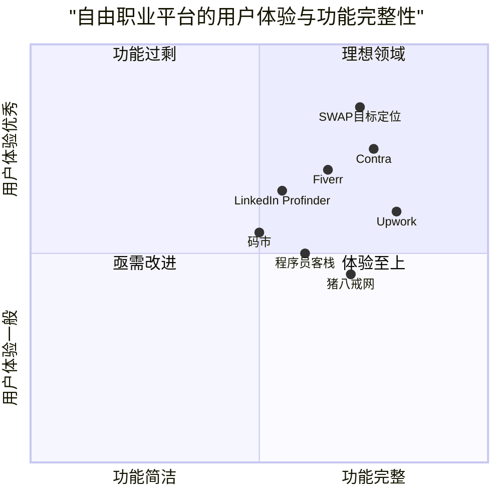

# SWAP 应用产品需求分析报告

## 1. 产品概述

### 1.1 产品背景

SWAP是一款服务于自由职业接单者（平面设计师、软件开发者等）的移动应用，作为已开发好的PC端网页平台的配套产品，旨在提升自由职业者实时管理项目订单、维护个人品牌、接收关键通知的效率，从而增强用户粘性。产品主视觉颜色为3C52AB，采用类似Contra的平台运营模式。

### 1.2 产品目标

1. **提高用户工作效率**：通过移动端实时管理项目，减少对电脑的依赖，提升响应速度
2. **增强用户体验**：打造直观、高效的移动体验，实现PC端与移动端的无缝衔接
3. **提升平台粘性**：通过及时通知、便捷管理和品牌展示功能，增加用户对平台的依赖度

### 1.3 用户故事

- 作为一名自由设计师，我希望能随时查看项目进度和合同细节，以便在外出时也能响应客户需求
- 作为一名软件开发自由职业者，我希望能及时接收不同类型的通知，以便快速区分优先级并做出响应
- 作为一名新入行的自由职业者，我希望能方便地分享我的个人名片，以便拓展我的客户网络
- 作为一名经验丰富的自由职业者，我希望能展示我的项目评价，以便在竞争中脱颖而出获得更多项目
- 作为一名忙碌的自由职业者，我希望移动端应用界面直观高效，以便最大化我的工作效率

### 1.4 竞品分析

| 产品名称 | 优势 | 劣势 |
|---------|------|------|
| Contra | • 全方位的项目管理工具<br>• 内置合同管理系统<br>• 强调透明度和社区建设<br>• 完善的作品集展示功能 | • 用户界面较为复杂<br>• 移动端功能较PC端受限<br>• 通知系统不够智能 |
| Fiverr | • 简洁直观的用户界面<br>• 强大的搜索和发现功能<br>• 完善的评价体系<br>• 品牌知名度高 | • 项目管理功能较弱<br>• 合同管理不够灵活<br>• 平台抽成比例较高 |
| Upwork | • 详细的时间跟踪功能<br>• 完善的支付保障系统<br>• 多样化的项目类型<br>• 强大的客户筛选功能 | • 界面复杂度高<br>• 移动端响应性不足<br>• 通知系统过于频繁 |
| 猪八戒网 | • 本地化服务完善<br>• 丰富的项目种类<br>• 交易流程简单<br>• 支付方式多样 | • 设计风格较为老旧<br>• 高端项目资源有限<br>• 移动端体验欠佳 |
| 程序员客栈 | • 专注于技术领域<br>• 精准的技能匹配<br>• 社区属性强<br>• 知识分享功能 | • 界面设计不够现代<br>• 移动端功能有限<br>• 缺少个性化展示 |
| LinkedIn Profinder | • 与专业社交网络整合<br>• 品牌信誉度高<br>• 客户质量高 | • 项目管理功能薄弱<br>• 缺乏专门的合同管理<br>• 通知系统不够分类 |
| 码市 | • 技术需求精准<br>• 项目流程清晰<br>• 支付保障完善 | • 界面设计较为简单<br>• 通知系统不够智能<br>• 缺乏个性化展示 |

### 1.5 竞争象限图



## 2. 用户体验分析

### 2.1 目标用户画像

#### 专业型自由设计师 - 李梅（28岁）
- 3-5年平面设计经验，已有稳定客户群
- 需要随时管理多个进行中的项目
- 重视个人品牌建设，经常需要展示作品集
- 希望通过高质量评价获取更多优质项目

#### 技术型自由开发者 - 王强（32岁）
- 5年以上软件开发经验，专注于前端开发
- 同时处理2-3个项目，需要严格管理时间和任务
- 依赖合同条款明确责任范围
- 希望通过技术专长和高评分提升接单价格

#### 新手自由职业者 - 张小明（25岁）
- 刚开始自由职业生涯，需要建立信誉
- 积极寻找新客户，频繁分享个人名片
- 密切关注平台通知，不想错过任何机会
- 希望通过初期良好表现获得正面评价

### 2.2 用户核心需求分析

#### 1. 高效项目管理需求
- **问题**：自由职业者经常同时管理多个项目，需要随时随地查看进度、截止日期和合同细节
- **期望**：简洁直观的项目管理界面，快速访问关键信息，便捷的合同查看体验
- **解决方案**：项目仪表盘设计，重要节点突出显示，合同要点一目了然

#### 2. 智能通知管理需求
- **问题**：各类通知混杂导致重要信息被淹没，影响工作效率和客户响应速度
- **期望**：分类清晰的通知系统，重要信息优先提醒，可自定义通知偏好
- **解决方案**：多维度通知分类系统，优先级视觉区分，智能通知设置

#### 3. 便捷的品牌推广需求
- **问题**：自由职业者需要频繁展示个人作品和专业能力，传统方式效率低
- **期望**：随时可分享的专业电子名片，展示作品集和技能的最佳方式
- **解决方案**：一键分享功能，可定制的个人名片设计，多平台兼容分享

#### 4. 有效的信誉建设需求
- **问题**：在竞争激烈的自由职业市场，良好的评价是获取优质项目的关键
- **期望**：突出展示正面评价，管理客户反馈，提升个人品牌形象
- **解决方案**：评价精选展示，数据可视化呈现，评价回应功能

### 2.3 核心交互逻辑

#### 1. 项目为中心的工作流
自由职业者的核心工作内容围绕项目展开，因此应用的主要工作流应以项目为中心，从项目入口可快速访问相关合同、消息、评价等信息。

#### 2. 通知驱动的行为模式
平台通知是触发用户行动的重要因素，通知系统需要足够智能，将通知与对应的行动选项绑定，减少用户操作路径。

#### 3. 个人展示的社交属性
个人名片和评价展示具有社交属性，需要设计易于分享和传播的机制，同时保持专业形象。

#### 4. 无缝的跨平台体验
作为PC端的配套应用，移动端需要与Web版保持数据和功能的一致性，确保用户可以在不同设备间无缝切换。

## 3. 产品界面规划

### 3.1 信息架构

```
SWAP应用
├── 主页/仪表盘
│   ├── 项目概览卡片
│   ├── 重要日程提醒
│   ├── 收入统计简报
│   └── 紧急通知预览
│
├── 项目管理中心
│   ├── 项目列表
│   │   ├── 进行中项目
│   │   ├── 已完成项目
│   │   └── 待确认项目
│   ├── 项目详情
│   │   ├── 项目时间线
│   │   ├── 里程碑追踪
│   │   ├── 交付物管理
│   │   ├── 客户沟通记录
│   │   └── 相关合同链接
│   └── 合同管理
│       ├── 合同预览
│       ├── 合同详情
│       ├── 支付里程碑
│       └── 条款要点提示
│
├── 通知中心
│   ├── 项目通知
│   │   ├── 截止日期提醒
│   │   ├── 客户消息
│   │   └── 付款通知
│   ├── 平台通知
│   │   ├── 系统更新
│   │   ├── 活动推广
│   │   └── 市场机会
│   └── 通知设置
│
├── 个人名片/作品集
│   ├── 个人简介
│   ├── 技能展示
│   ├── 作品集
│   ├── 评价精选
│   └── 分享选项
│
└── 评价管理
    ├── 评价概览
    ├── 评价详情
    ├── 回应评价
    └── 评价统计分析
```

### 3.2 关键界面设计

#### 1. 主页/仪表盘

**目标**：提供用户工作状态的即时概览，突出显示需要立即关注的事项

**创新点**：
- **智能工作优先级**：基于截止日期、客户重要性和项目价值自动排序的任务清单
- **动态收入预测**：可视化展示当前项目完成后的预期收入
- **健康工作提醒**：基于工作时长和强度的健康提示，鼓励合理安排工作

**核心元素**：
- 项目卡片（显示进度条、倒计时、关键行动）
- 今日任务简报
- 收入仪表盘（本周/本月/预期）
- 高优先级通知气泡
- 快捷操作按钮（新建项目、查看合同、分享名片）

#### 2. 项目管理中心

**目标**：集中管理所有项目，提供详细的项目信息和操作入口

**创新点**：
- **可视化项目时间线**：直观展示项目各阶段和关键节点
- **智能风险提示**：基于历史数据和项目进度自动识别潜在风险点
- **合同速览**：重要合同条款的视觉化呈现，避免冗长文本

**核心元素**：
- 标签式项目分类（进行中、已完成、待确认）
- 项目详情面板（包含时间线、里程碑、交付物）
- 合同查看器（支持关键词搜索和重点标记）
- 客户沟通聊天界面
- 交付物上传/预览区域

#### 3. 通知中心

**目标**：提供清晰分类的通知系统，确保用户不会错过重要信息

**创新点**：
- **上下文感知通知**：根据用户当前状态和项目阶段推送相关通知
- **行动导向设计**：通知直接关联可执行操作，减少操作步骤
- **注意力管理模式**：可设定专注工作时段，暂停非紧急通知

**核心元素**：
- 分类标签（项目通知、系统通知、市场机会）
- 通知卡片（包含时间、来源、简要内容、操作按钮）
- 通知筛选器
- 自定义通知设置面板
- 未读/已读状态指示器

#### 4. 个人名片/作品集

**目标**：提供专业的个人展示和便捷的分享功能，帮助自由职业者拓展业务

**创新点**：
- **动态名片**：根据分享目标（客户、同行、社交平台）自动调整内容侧重点
- **在线作品集**：支持多种媒体格式，可设置访问权限的作品展示
- **技能可视化**：以图表形式展示专业技能和熟练度

**核心元素**：
- 个人头像和简介
- 技能标签云
- 精选作品展示区
- 客户评价精选
- 多平台一键分享按钮
- 名片预览和自定义选项

#### 5. 评价管理

**目标**：系统化展示和管理客户评价，强化个人品牌

**创新点**：
- **评价故事化**：将评价与项目成果关联展示，构建完整服务案例
- **数据洞察**：评价数据分析，识别个人优势和改进空间
- **评价提醒**：智能提醒用户向满意客户请求评价的最佳时机

**核心元素**：
- 评分概览（星级分布、平均得分）
- 评价列表（带筛选和排序功能）
- 评价详情卡片（客户信息、项目简介、评价内容、回应区）
- 数据分析图表（评分趋势、强项弱项分析）
- 评价请求功能

### 3.3 导航结构

采用底部标签栏导航，确保单手操作便捷性：

1. **主页**：仪表盘和概览
2. **项目**：项目管理和合同查看
3. **通知**：分类消息通知中心
4. **名片**：个人名片和作品集
5. **更多**：包含评价管理、设置等功能

### 3.4 视觉设计指南

#### 1. 色彩方案
- **主色**：#3C52AB（品牌蓝）
- **辅助色**：
  - 深蓝：#2A3A7B（强调和按钮按压状态）
  - 浅蓝：#6B7FCC（次要元素和图标）
  - 亮橙：#FF9D42（对比色，用于关键行动点和提醒）
  - 薄荷绿：#4CD7A5（积极状态和成功提示）
  - 珊瑚红：#FF6B6B（警示和错误提示）

#### 2. 排版系统
- **标题字体**：SF Pro Display / 思源黑体
- **正文字体**：SF Pro Text / 思源黑体
- **字号层级**：
  - 大标题：20px
  - 小标题：16px
  - 正文：14px
  - 辅助文本：12px

#### 3. 界面组件风格
- **卡片设计**：轻微圆角（12px），微妙阴影，清晰边界
- **按钮样式**：胶囊形状，明确的点击状态
- **图标系统**：线性图标，统一粗细，保持品牌一致性
- **状态指示器**：使用色彩和形状的组合传达状态信息

## 4. 技术规格

### 4.1 需求分析

SWAP移动应用需要提供以下核心功能：

1. **项目管理系统**
   - 实时项目状态同步
   - 合同文档在线查看
   - 里程碑追踪和提醒
   - 客户沟通记录

2. **通知管理系统**
   - 多维度消息分类
   - 可定制的通知偏好
   - 通知-行动直接关联
   - 未读状态同步

3. **个人名片功能**
   - 可定制的个人简介
   - 作品集展示
   - 多渠道分享机制
   - 访问数据统计

4. **评价展示系统**
   - 评价收集和展示
   - 评分数据分析
   - 回应功能
   - 精选展示设置

### 4.2 需求池

| ID | 需求描述 | 优先级 | 复杂度 |
|----|---------|-------|-------|
| R001 | 用户可以查看所有进行中的项目列表及详情 | P0 | 中 |
| R002 | 用户可以查看与项目关联的合同文件 | P0 | 中 |
| R003 | 系统应提供分类的消息通知功能 | P0 | 高 |
| R004 | 用户可以一键分享个人专业名片 | P0 | 中 |
| R005 | 系统应展示用户的项目评价和评分 | P0 | 中 |
| R006 | 用户可以回应客户的评价 | P1 | 低 |
| R007 | 用户可以上传和管理作品集 | P0 | 高 |
| R008 | 系统应提供项目时间线和里程碑视图 | P0 | 高 |
| R009 | 用户可以自定义通知设置和偏好 | P1 | 中 |
| R010 | 系统应提供项目收入统计和预测 | P1 | 高 |
| R011 | 用户可以管理客户沟通记录 | P0 | 高 |
| R012 | 系统应支持合同重点条款标记和查找 | P1 | 高 |
| R013 | 用户可以自定义个人名片内容和样式 | P2 | 中 |
| R014 | 系统应提供评价数据分析和趋势图表 | P2 | 高 |
| R015 | 用户可以设置专注工作模式，控制通知干扰 | P2 | 低 |
| R016 | 系统应支持离线访问关键项目文档 | P1 | 高 |
| R017 | 用户可以通过应用直接与客户沟通 | P0 | 高 |
| R018 | 系统应提供智能项目风险提示 | P2 | 高 |
| R019 | 用户可以请求客户提供评价 | P1 | 低 |
| R020 | 系统应支持多语言界面 | P2 | 中 |

### 4.3 UI设计草图

由于产品分析报告阶段不包含具体的UI设计实现，这里仅提供核心界面的布局原则和关键元素描述，详细的UI设计将在后续阶段完成。

## 5. 开放问题

1. **项目数据同步策略**：需要确定移动端与PC端数据同步的频率和机制，尤其是在网络不稳定情况下的处理策略

2. **安全认证机制**：考虑到合同等敏感信息的访问，需要确定合适的安全认证机制和权限控制方案

3. **应用的离线功能范围**：需要明确哪些功能在离线状态下可用，以及数据同步策略

4. **多语言支持计划**：如果平台计划国际化，需要确定语言支持的优先级和实施计划

5. **通知推送机制**：需要明确不同类型通知的推送策略，平衡及时性与用户体验

6. **评价系统的激励机制**：考虑如何鼓励客户提供评价，以及可能的激励措施

7. **版本迭代规划**：确定功能实现的优先级和版本迭代计划，包括MVP定义和后续功能扩展路线

## 6. 结论

SWAP移动应用的设计以自由职业者的实际需求为中心，通过项目管理、通知系统、个人名片和评价展示等核心功能，为用户提供全方位的移动办公体验。应用的设计重点在于简洁高效的界面、智能化的信息处理和专业化的个人展示，旨在成为自由职业者不可或缺的工作助手。

通过与PC端的无缝配合，SWAP应用将显著提升自由职业者的工作效率和客户响应速度，同时帮助他们更好地管理个人品牌和专业声誉，增强用户对平台的粘性和依赖度。

产品视觉设计将以3C52AB为主色调，打造专业、可靠且现代的品牌形象，与目标用户群体的专业定位相匹配。产品界面将注重用户体验，确保操作流畅直观，信息层次清晰，为自由职业者提供高效愉悦的使用体验。